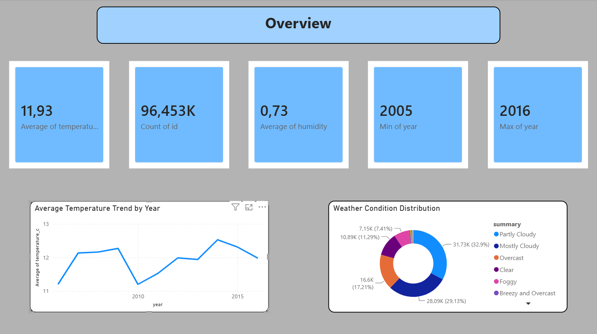
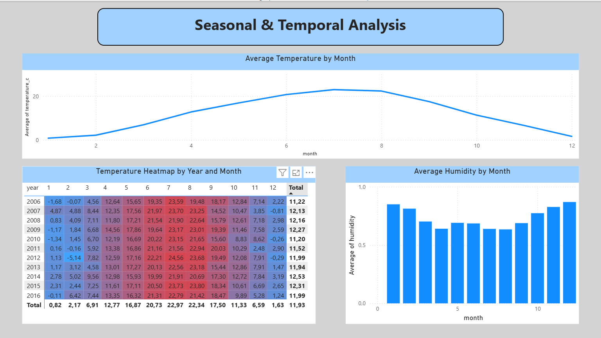
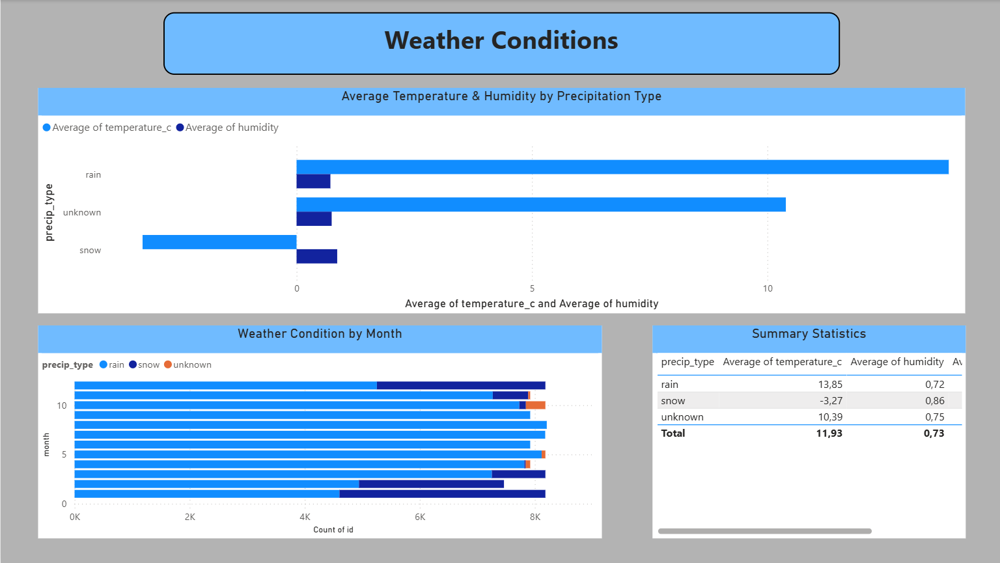

# Hava Durumu Veri Analizi - Pandas & MySQL ile İlişkisel Veri Modelleme

Kaggle üzerinden alınan bir hava durumu veri setinin Python (Pandas/NumPy) ile temizlenip normalize edilmesi ve MySQL'de foreign key ilişkisiyle bağlanan iki ayrı tabloya aktarılması projesi.

## Proje Amacı

Bu proje, ham bir CSV verisini gerçek bir ilişkisel veritabanı yapısına dönüştürme sürecini uçtan uca göstermeyi amaçlar:

- Veri temizliği ve tarih manipülasyonu (Pandas/NumPy)
- Tabloyu SQL'e uygun hale getirme
- Tekrar eden kategorik verileri ayrı bir tabloya normalize etme (1NF/2NF mantığı)
- MySQL'de `PRIMARY KEY` / `FOREIGN KEY` ile iki tabloyu ilişkilendirme
- `LOAD DATA INFILE` ile CSV'den MySQL'e veri aktarımı

## Kullanılan Veri Seti

[Kaggle - Weather History Dataset](https://www.kaggle.com/datasets/budincsevity/szeged-weather) (`weatherHistory.csv`) - saatlik hava durumu ölçümleri (sıcaklık, nem, rüzgar, basınç, görüş mesafesi vb.) ve kategorik hava durumu özetleri içerir.

## Proje Yapısı

```
├── datasets/
│   ├── weatherHistory.csv        # Ham, orijinal veri seti (Kaggle)
│   ├── lastWeatherHistory.csv    # Temizlenmiş ve normalize edilmiş ana veri
│   └── statusTypes.csv           # Kategorik hava durumu özetleri (lookup tablo)
├── weather_cleaning.py           # Veri temizliği, normalizasyon, hata yönetimi ve CSV export
├── weather_schema.sql            # Tablo oluşturma (DDL) ve foreign key tanımları
├── weather_load_data.sql         # CSV'den MySQL'e veri aktarım sorguları
├── run_pipeline.py               # weather_schema.sql + weather_load_data.sql'i otomatik çalıştırıp
│                                  # foreign key ilişkisini doğrulayan pipeline scripti
├── .env.example                  # Veritabanı bağlantı bilgileri için şablon (.env oluştururken kopyala)
├── weather_dashboard.pbix        # Power BI raporu (3 sayfa: Overview, Seasonal Analysis, Weather Conditions)
├── screenshots/                  # Dashboard sayfalarının ekran görüntüleri
│   ├── overview.png
│   ├── seasonal_analysis.png
│   └── weather_conditions.png
└── README.md
```

## Kurulum

1. Gerekli kütüphaneleri kur:
   ```bash
   pip install pandas numpy mysql-connector-python python-dotenv
   ```

2. `.env.example` dosyasını `.env` olarak kopyala ve kendi MySQL bilgilerinle doldur:
   ```
   DB_HOST=localhost
   DB_USER=root
   DB_PASSWORD=senin_sifren
   DB_NAME=veritabani_adin
   ```
   > `.env` dosyası `.gitignore` içinde olmalı ve asla GitHub'a yüklenmemeli.

3. Veri temizliğini çalıştır:
   ```bash
   python weather_cleaning.py
   ```

4. Veritabanı pipeline'ını çalıştır (tabloları oluşturur, veriyi yükler, foreign key ilişkisini doğrular):
   ```bash
   python run_pipeline.py
   ```

## İş Akışı (Pipeline)

### 1. Veri Temizliği (Python / Pandas)

- Eksik değerler `'unknown'` ile dolduruldu.
- `Formatted Date` sütunu `datetime` tipine çevrildi ve `Year`, `Month`, `Day` olarak parçalara ayrıldı.
- Sütun isimleri MySQL uyumlu hale getirildi (küçük harf, alt çizgi, parantez/özel karakter temizliği).
- Kullanılmayan `loud_cover` sütunu kaldırıldı.

### 2. Normalizasyon - İki Tabloya Ayırma

Tekrar eden kategorik veriler (`summary`, `precip_type`) ana tablodan ayrılarak `status_types` adında bir lookup tabloya taşındı. Bu, aynı kategori bilgisinin binlerce satırda tekrar tekrar depolanmasını önler.

```python
status_types = df[['summary', 'precip_type']].drop_duplicates().reset_index(drop=True)
status_types['status_id'] = range(1, len(status_types) + 1)

df = df.merge(status_types, on=['summary', 'precip_type'], how='left')

df.drop(['summary', 'precip_type'], axis=1, inplace=True)
```

Her satır, `status_id` üzerinden `status_types` tablosuna referans verecek şekilde ana tablodan (`weather_data`) ayrıştırıldı ve sonuçlar iki ayrı CSV olarak dışa aktarıldı.

### 3. MySQL Tablo Yapısı (DDL)

```sql
CREATE TABLE status_types (
    status_id INT PRIMARY KEY,
    summary VARCHAR(100),
    precip_type VARCHAR(50)
);

CREATE TABLE weather_data (
    id INT AUTO_INCREMENT PRIMARY KEY,
    formatted_date DATETIME,
    temperature_c FLOAT,
    apparent_temperature_c FLOAT,
    humidity FLOAT,
    wind_speed_kmh FLOAT,
    wind_bearing_degrees FLOAT,
    visibility_km FLOAT,
    pressure_millibars FLOAT,
    daily_summary TEXT,
    year INT,
    month INT,
    day INT,
    status_id INT
);

ALTER TABLE weather_data
ADD CONSTRAINT fk_weather_status
FOREIGN KEY (status_id) REFERENCES status_types(status_id);
```

### 4. Veri Aktarımı (CSV → MySQL)

```sql
LOAD DATA LOCAL INFILE 'datasets/statusTypes.csv'
INTO TABLE status_types
FIELDS TERMINATED BY ','
ENCLOSED BY '"'
LINES TERMINATED BY '\r\n'
IGNORE 1 ROWS
(summary, precip_type, status_id);

LOAD DATA LOCAL INFILE 'datasets/lastWeatherHistory.csv'
INTO TABLE weather_data
FIELDS TERMINATED BY ','
ENCLOSED BY '"'
LINES TERMINATED BY '\r\n'
IGNORE 1 ROWS
(formatted_date, temperature_c, apparent_temperature_c, humidity, wind_speed_kmh, wind_bearing_degrees, visibility_km, pressure_millibars, daily_summary, year, month, day, status_id);
```

> **Not:** `LOAD DATA INFILE` içindeki sütun sırası, CSV dosyasındaki sütun sırasıyla birebir eşleşmelidir. Sıra tutmazsa MySQL veriyi yanlış sütunlara yazar (örn. metin bir değeri `status_id` gibi sayısal bir sütuna yazmaya çalışır ve hata verir).
>
> **Önemli:** Bu göreli yollar (`datasets/...`), sorguyu **proje kök klasöründen** çalıştırdığın varsayımıyla yazıldı - yani `weather_load_data.sql`'i çalıştırdığın MySQL client'ının (Workbench, terminal vb.) çalışma dizini proje kökü olmalı. Eğer farklı bir klasörden çalıştırırsan, yolu ona göre güncellemen gerekir.

### 5. Doğrulama

Foreign key ilişkisinin sadece yapısal değil, veri düzeyinde de doğru kurulduğunu teyit etmek için:

```sql
SELECT COUNT(*) FROM weather_data WHERE status_id IS NULL;
-- Sonuç: 0
```

## Dashboard (Power BI)

MySQL'deki `weather_data` ve `status_types` tabloları Power BI'a canlı bağlantıyla (Get Data → MySQL Database) aktarıldı, tablolar arasındaki ilişki `status_id` üzerinden Power BI Model ekranında kuruldu (many-to-one). 3 sayfalık bir rapor hazırlandı:

### Sayfa 1 - Overview


Genel özet: ortalama sıcaklık (11.93°C), toplam kayıt sayısı (~96,453), yıllara göre sıcaklık trendi ve hava durumu kategorilerinin dağılımı. En sık görülen kategori "Partly Cloudy" (%32.9).

### Sayfa 2 - Seasonal & Temporal Analysis


Aylık sıcaklık mevsimselliği net görülüyor: Temmuz civarında zirve (~23°C), Ocak'ta en düşük (~0.8°C). Yıl x Ay ısı haritası, yıllar arası mevsimsel tutarlılığı gösteriyor.

### Sayfa 3 - Weather Conditions


`status_types` tablosuyla kurulan foreign key ilişkisi kullanılarak: yağış tipine göre sıcaklık/nem karşılaştırması (kar yağışında ortalama sıcaklık -3.27°C, yağmurda 13.85°C) ve aylara göre yağış tipi dağılımı.


## Kullanılan Teknolojiler

- Python (Pandas, NumPy)
- MySQL
- CSV / `LOAD DATA INFILE`
- Power BI (Power Query, DAX, veri modelleme)

## Tamamlananlar

- [x] Veri temizliği ve normalizasyon (Python)
- [x] SQL şema ve foreign key ilişkisi (yapısal + veri düzeyinde doğrulandı)
- [x] Hata yönetimi (try/except) - dosya okuma, tarih dönüşümü, merge, veritabanı bağlantısı
- [x] Tek komutla çalışan otomatik pipeline (`run_pipeline.py`) ve güvenli kimlik bilgisi yönetimi (`.env`)
- [x] Power BI ile 3 sayfalık dashboard (Overview, Seasonal & Temporal Analysis, Weather Conditions)

## Sonraki Adımlar

- [ ] Daha detaylı korelasyon analizleri (sıcaklık-nem-görüş mesafesi ilişkileri)
- [ ] Power BI raporunu web'de yayınlama (Power BI Service)
